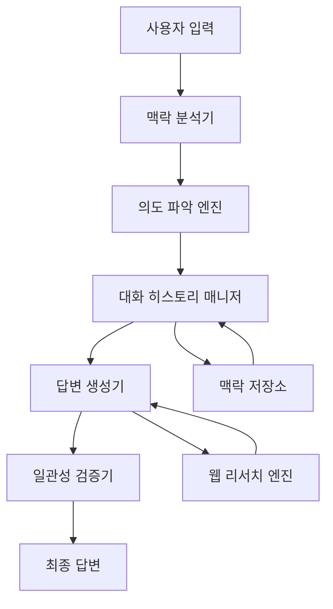

# 대화 맥락 추적 시스템 설계

## 개요

대화 맥락 추적 시스템은 AI 룰 마스터가 사용자와의 대화에서 일관성을 유지하고 맥락을 잃지 않도록 하는 핵심 시스템입니다. 이 시스템은 대화 히스토리 관리, 맥락 분석, 의도 파악, 그리고 답변 일관성 검증을 통해 사용자 경험을 크게 개선합니다.

## 아키텍처

### 전체 시스템 구조



### 핵심 컴포넌트

1. **대화 히스토리 매니저 (ConversationHistoryManager)**
   - 대화 세션 관리
   - 맥락 정보 저장 및 검색
   - 주제 전환 감지

2. **맥락 분석기 (ContextAnalyzer)**
   - 현재 질문의 맥락 분석
   - 이전 대화와의 연관성 파악
   - 주제 연속성 판단

3. **의도 파악 엔진 (IntentRecognizer)**
   - 질문의 진짜 의도 파악
   - 암시적 참조 해석
   - 후속 질문 패턴 인식

4. **일관성 검증기 (ConsistencyValidator)**
   - 답변 일관성 검증
   - 이전 답변과의 모순 감지
   - 오류 패턴 학습

## 컴포넌트 및 인터페이스

### ConversationHistoryManager

```typescript
interface ConversationContext {
  sessionId: string;
  currentTopic: string;
  gameContext?: string;
  questionHistory: QuestionHistoryItem[];
  topicStartTurn: number;
  lastUpdated: Date;
}

interface QuestionHistoryItem {
  turn: number;
  question: string;
  answer: string;
  topic: string;
  confidence: number;
  wasResearched: boolean;
  timestamp: Date;
}

class ConversationHistoryManager {
  async getContext(sessionId: string): Promise<ConversationContext>
  async updateContext(sessionId: string, item: QuestionHistoryItem): Promise<void>
  async detectTopicChange(newQuestion: string, context: ConversationContext): Promise<boolean>
  async getRelevantHistory(sessionId: string, currentQuestion: string): Promise<QuestionHistoryItem[]>
}
```

### ContextAnalyzer

```typescript
interface ContextAnalysis {
  currentTopic: string;
  relatedToHistory: boolean;
  referenceType: 'direct' | 'implicit' | 'none';
  referencedTurn?: number;
  confidence: number;
  keywords: string[];
}

class ContextAnalyzer {
  analyzeContext(question: string, history: QuestionHistoryItem[]): ContextAnalysis
  extractKeywords(text: string): string[]
  calculateRelevanceScore(question: string, historyItem: QuestionHistoryItem): number
}
```

### IntentRecognizer

```typescript
interface IntentAnalysis {
  primaryIntent: 'question' | 'correction' | 'clarification' | 'followup';
  isChallengingPreviousAnswer: boolean;
  referencedAnswer?: QuestionHistoryItem;
  implicitContext: string[];
  confidence: number;
}

class IntentRecognizer {
  recognizeIntent(question: string, context: ConversationContext): IntentAnalysis
  detectCorrectionIntent(question: string): boolean
  extractImplicitReferences(question: string, history: QuestionHistoryItem[]): string[]
}
```

### ConsistencyValidator

```typescript
interface ConsistencyCheck {
  isConsistent: boolean;
  conflictingAnswers: QuestionHistoryItem[];
  confidenceLevel: 'high' | 'medium' | 'low';
  recommendsResearch: boolean;
  errorType?: 'factual' | 'contextual' | 'logical';
}

class ConsistencyValidator {
  validateConsistency(newAnswer: string, context: ConversationContext): ConsistencyCheck
  detectFactualConflicts(answer1: string, answer2: string): boolean
  assessAnswerConfidence(answer: string, researchData?: string): number
}
```

## 데이터 모델

### 대화 세션 저장소

```typescript
// Supabase 테이블 구조
interface ConversationSession {
  id: string;
  user_id?: string;
  session_id: string;
  current_topic: string;
  game_context?: string;
  topic_start_turn: number;
  created_at: Date;
  updated_at: Date;
}

interface QuestionHistory {
  id: string;
  session_id: string;
  turn_number: number;
  question: string;
  answer: string;
  topic: string;
  confidence: number;
  was_researched: boolean;
  context_analysis: ContextAnalysis;
  intent_analysis: IntentAnalysis;
  created_at: Date;
}
```

### 메모리 캐시 구조

```typescript
// LRU 캐시를 사용한 세션 관리
interface SessionCache {
  contexts: Map<string, ConversationContext>;
  maxSessions: number;
  ttl: number; // 30분
}
```

## 세션 생명주기 관리

### 세션 보존 정책

1. **활성 세션 (메모리)**
   - 사용자가 활발히 대화 중인 세션
   - 메모리 캐시에 30분간 유지
   - 빠른 응답을 위한 즉시 접근

2. **휴면 세션 (데이터베이스)**
   - 사용자가 나간 후에도 7일간 Supabase에 보존
   - 재방문 시 대화 맥락 복원 가능
   - 사용자 경험 연속성 보장

3. **세션 정리 정책**
   ```typescript
   interface SessionCleanupPolicy {
     memoryTTL: number;        // 30분 (메모리 캐시)
     databaseTTL: number;      // 7일 (데이터베이스)
     maxSessionsPerUser: number; // 사용자당 최대 10개 세션
     cleanupInterval: number;   // 매일 자정 정리
   }
   ```

### 세션 복원 메커니즘

```typescript
class SessionManager {
  // 사용자 재방문 시 이전 세션 복원
  async restoreSession(userId: string): Promise<ConversationContext | null> {
    const recentSession = await this.getRecentSession(userId);
    if (recentSession && this.isWithinTTL(recentSession)) {
      return this.loadContextFromDatabase(recentSession.session_id);
    }
    return null;
  }
  
  // 세션 자동 정리
  async cleanupExpiredSessions(): Promise<void> {
    await this.deleteExpiredSessions();
    await this.archiveOldSessions();
  }
}
```

### 사용자별 세션 관리

- **익명 사용자**: 브라우저 세션 기반, 탭 닫으면 7일 후 삭제
- **로그인 사용자**: 계정 기반 세션 관리, 여러 기기에서 동기화 가능
- **세션 한계**: 사용자당 최대 10개 세션, 오래된 것부터 자동 삭제

## 오류 처리

### 오류 감지 패턴

1. **사용자 지적 패턴**
   - "틀린거네?", "아닌데?", "잘못됐어"
   - "그게 맞나?", "확실해?"

2. **맥락 불일치 감지**
   - 동일 주제에 대한 상반된 답변
   - 숫자나 사실 정보의 불일치

3. **자동 오류 복구**
   ```typescript
   interface ErrorRecovery {
     acknowledgeError(): string;
     requestCorrection(): Promise<string>;
     updateHistory(correction: string): Promise<void>;
     preventSimilarErrors(): void;
   }
   ```

## 테스트 전략

### 단위 테스트
- 각 컴포넌트별 독립적 테스트
- 모의 데이터를 사용한 맥락 분석 테스트
- 의도 파악 정확도 테스트

### 통합 테스트
- 전체 대화 플로우 테스트
- 실제 대화 시나리오 재현
- 오류 복구 메커니즘 테스트

### 성능 테스트
- 대화 히스토리 검색 속도
- 메모리 사용량 모니터링
- 동시 세션 처리 능력

## 모니터링 및 분석

### 주요 메트릭
- 맥락 추적 정확도
- 의도 파악 성공률
- 오류 감지 및 복구율
- 사용자 만족도 개선

### 로깅 전략
```typescript
interface ContextLog {
  sessionId: string;
  turn: number;
  contextAccuracy: number;
  intentRecognitionSuccess: boolean;
  errorDetected: boolean;
  userSatisfaction?: number;
}
```