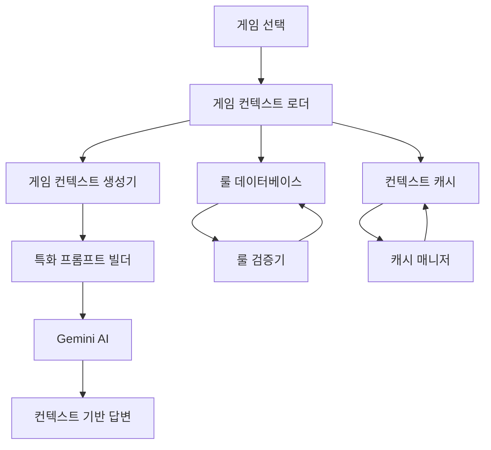

# 게임 컨텍스트 강화 시스템 설계

## 개요

게임 컨텍스트 강화 시스템은 사용자가 특정 게임을 선택했을 때 AI가 해당 게임의 구체적인 룰 정보를 활용하여 전문적이고 정확한 답변을 제공할 수 있도록 하는 시스템입니다. 이 시스템은 게임별 룰 데이터베이스, 동적 컨텍스트 로딩, 특화 프롬프트 생성, 그리고 성능 최적화를 통해 사용자 경험을 크게 개선합니다.

## 아키텍처

### 전체 시스템 구조



### 핵심 컴포넌트

1. **게임 룰 데이터베이스 (GameRuleDatabase)**
   - 게임별 상세 룰 정보 저장
   - 구조화된 룰 데이터 관리
   - 룰 업데이트 및 버전 관리

2. **게임 컨텍스트 로더 (GameContextLoader)**
   - 게임 선택 시 컨텍스트 동적 로딩
   - 캐시 우선 로딩 전략
   - 실패 시 대체 컨텍스트 제공

3. **특화 프롬프트 빌더 (SpecializedPromptBuilder)**
   - 게임별 맞춤형 프롬프트 생성
   - 룰 정보와 사용자 질문 연결
   - 컨텍스트 기반 답변 가이드라인 생성

4. **컨텍스트 캐시 매니저 (ContextCacheManager)**
   - 게임 컨텍스트 메모리 캐싱
   - LRU 기반 캐시 관리
   - 성능 최적화 및 메모리 관리

## 컴포넌트 및 인터페이스

### GameRuleDatabase

```typescript
interface GameRule {
  gameId: number;
  gameTitle: string;
  category: 'basic' | 'advanced' | 'variant' | 'faq';
  ruleType: 'setup' | 'gameplay' | 'endgame' | 'scoring' | 'special';
  title: string;
  content: string;
  examples?: string[];
  relatedRules?: string[];
  source: string;
  lastUpdated: Date;
  verified: boolean;
}

interface GameContext {
  gameId: number;
  gameTitle: string;
  basicRules: GameRule[];
  endgameRules: GameRule[];
  specialRules: GameRule[];
  commonQuestions: GameRule[];
  keyTerms: { [key: string]: string };
  ruleInteractions: RuleInteraction[];
  lastUpdated: Date;
}

interface RuleInteraction {
  id: string;
  title: string;
  description: string;
  involvedRules: string[];
  resolution: string;
  examples: string[];
}

class GameRuleDatabase {
  async getGameContext(gameId: number): Promise<GameContext | null>
  async getGameRules(gameId: number, category?: string): Promise<GameRule[]>
  async searchRules(gameId: number, query: string): Promise<GameRule[]>
  async addGameRule(rule: GameRule): Promise<void>
  async updateGameRule(ruleId: string, updates: Partial<GameRule>): Promise<void>
  async verifyRule(ruleId: string, verified: boolean): Promise<void>
}
```

### GameContextLoader

```typescript
interface ContextLoadOptions {
  gameId: number;
  gameTitle: string;
  useCache: boolean;
  fallbackToGeneric: boolean;
}

interface LoadedContext {
  context: GameContext;
  source: 'cache' | 'database' | 'fallback';
  loadTime: number;
  cacheHit: boolean;
}

class GameContextLoader {
  async loadGameContext(options: ContextLoadOptions): Promise<LoadedContext>
  async preloadPopularGames(): Promise<void>
  async refreshContext(gameId: number): Promise<void>
  private async loadFromCache(gameId: number): Promise<GameContext | null>
  private async loadFromDatabase(gameId: number): Promise<GameContext | null>
  private createFallbackContext(gameTitle: string): GameContext
}
```

### SpecializedPromptBuilder

```typescript
interface PromptContext {
  gameContext: GameContext;
  userQuestion: string;
  conversationHistory?: QuestionHistoryItem[];
  questionType: 'rule' | 'strategy' | 'clarification' | 'example';
}

interface BuiltPrompt {
  systemPrompt: string;
  gameSpecificContext: string;
  ruleReferences: string[];
  confidenceIndicators: string[];
  fallbackInstructions: string;
}

class SpecializedPromptBuilder {
  buildGameSpecificPrompt(context: PromptContext): BuiltPrompt
  private extractRelevantRules(gameContext: GameContext, question: string): GameRule[]
  private generateRuleContext(rules: GameRule[]): string
  private addConfidenceIndicators(rules: GameRule[]): string[]
  private createFallbackInstructions(gameTitle: string): string
}
```

### ContextCacheManager

```typescript
interface CacheEntry {
  gameId: number;
  context: GameContext;
  lastAccessed: Date;
  accessCount: number;
  size: number;
}

interface CacheStats {
  totalEntries: number;
  totalSize: number;
  hitRate: number;
  mostAccessed: { gameId: number; title: string; count: number }[];
}

class ContextCacheManager {
  async get(gameId: number): Promise<GameContext | null>
  async set(gameId: number, context: GameContext): Promise<void>
  async invalidate(gameId: number): Promise<void>
  async clear(): Promise<void>
  getStats(): CacheStats
  private evictLeastRecentlyUsed(): void
  private calculateSize(context: GameContext): number
}
```

## 데이터 모델

### 게임 룰 데이터베이스 스키마

```sql
-- 게임 룰 테이블
CREATE TABLE game_rules (
  id UUID PRIMARY KEY DEFAULT gen_random_uuid(),
  game_id INTEGER NOT NULL,
  game_title TEXT NOT NULL,
  category TEXT NOT NULL CHECK (category IN ('basic', 'advanced', 'variant', 'faq')),
  rule_type TEXT NOT NULL CHECK (rule_type IN ('setup', 'gameplay', 'endgame', 'scoring', 'special')),
  title TEXT NOT NULL,
  content TEXT NOT NULL,
  examples JSONB,
  related_rules TEXT[],
  source TEXT NOT NULL,
  last_updated TIMESTAMP WITH TIME ZONE DEFAULT NOW(),
  verified BOOLEAN DEFAULT FALSE,
  created_at TIMESTAMP WITH TIME ZONE DEFAULT NOW()
);

-- 룰 상호작용 테이블
CREATE TABLE rule_interactions (
  id UUID PRIMARY KEY DEFAULT gen_random_uuid(),
  game_id INTEGER NOT NULL,
  title TEXT NOT NULL,
  description TEXT NOT NULL,
  involved_rules TEXT[] NOT NULL,
  resolution TEXT NOT NULL,
  examples JSONB,
  created_at TIMESTAMP WITH TIME ZONE DEFAULT NOW()
);

-- 게임 용어 테이블
CREATE TABLE game_terms (
  id UUID PRIMARY KEY DEFAULT gen_random_uuid(),
  game_id INTEGER NOT NULL,
  term TEXT NOT NULL,
  definition TEXT NOT NULL,
  context TEXT,
  created_at TIMESTAMP WITH TIME ZONE DEFAULT NOW()
);
```

### 메모리 캐시 구조

```typescript
// LRU 캐시를 사용한 게임 컨텍스트 관리
interface GameContextCache {
  contexts: Map<number, CacheEntry>;
  maxSize: number; // 50MB
  maxEntries: number; // 100개 게임
  ttl: number; // 1시간
}
```

## 게임별 룰 데이터 구조

### 카탄 게임 예시

```typescript
const catanGameContext: GameContext = {
  gameId: 1,
  gameTitle: "카탄",
  basicRules: [
    {
      gameId: 1,
      gameTitle: "카탄",
      category: "basic",
      ruleType: "endgame",
      title: "게임 종료 조건",
      content: "한 플레이어가 자신의 턴에 승리점 10점에 도달하면 즉시 게임이 종료되고 해당 플레이어가 승리합니다.",
      examples: [
        "정착지 5개(5점) + 도시 2개(4점) + 가장 긴 도로(2점) = 11점으로 승리",
        "정착지 3개(3점) + 도시 3개(6점) + 발전 카드 1점 = 10점으로 승리"
      ],
      relatedRules: ["승리점 계산", "발전 카드 승리점"],
      source: "카탄 공식 룰북 v4.0",
      lastUpdated: new Date(),
      verified: true
    }
  ],
  endgameRules: [
    // 종료 관련 상세 룰들
  ],
  specialRules: [
    // 특수 상황 룰들
  ],
  commonQuestions: [
    {
      gameId: 1,
      gameTitle: "카탄",
      category: "faq",
      ruleType: "endgame",
      title: "게임 종료 타이밍",
      content: "승리점 10점은 자신의 턴 중에만 확인됩니다. 다른 플레이어의 턴에 10점에 도달해도 게임이 즉시 종료되지 않습니다.",
      examples: [
        "상대방이 나에게 자원을 줘서 내가 10점이 되어도, 내 턴이 와야 승리 선언 가능"
      ],
      source: "카탄 FAQ v2.1",
      lastUpdated: new Date(),
      verified: true
    }
  ],
  keyTerms: {
    "승리점": "게임에서 승리하기 위해 필요한 점수. 정착지, 도시, 발전 카드 등으로 획득",
    "정착지": "1승리점을 주는 기본 건물",
    "도시": "2승리점을 주는 업그레이드된 건물"
  },
  ruleInteractions: [
    {
      id: "catan-endgame-timing",
      title: "게임 종료와 발전 카드",
      description: "발전 카드로 10점에 도달할 때의 타이밍",
      involvedRules: ["게임 종료 조건", "발전 카드 사용"],
      resolution: "발전 카드는 자신의 턴에만 사용할 수 있으므로, 발전 카드로 10점에 도달하는 것도 자신의 턴에만 가능합니다.",
      examples: [
        "내 턴에 발전 카드를 사용해서 10점이 되면 즉시 승리",
        "다른 플레이어 턴에는 발전 카드를 사용할 수 없으므로 10점 달성 불가"
      ]
    }
  ],
  lastUpdated: new Date()
};
```

## 프롬프트 생성 전략

### 게임별 특화 프롬프트 템플릿

```typescript
const gameSpecificPromptTemplate = `
🎮 **${gameTitle} 전문 룰 마스터 모드**

당신은 ${gameTitle}의 전문가입니다. 다음 룰 정보를 바탕으로 정확하고 구체적인 답변을 제공하세요.

📋 **핵심 룰 정보:**
${relevantRules.map(rule => `
• **${rule.title}**: ${rule.content}
${rule.examples ? `  예시: ${rule.examples.join(', ')}` : ''}
`).join('\n')}

🔗 **관련 룰 상호작용:**
${ruleInteractions.map(interaction => `
• **${interaction.title}**: ${interaction.resolution}
`).join('\n')}

📚 **용어 정의:**
${Object.entries(keyTerms).map(([term, definition]) => `
• **${term}**: ${definition}
`).join('\n')}

⚡ **답변 지침:**
1. 위의 룰 정보를 우선적으로 참고하여 답변하세요
2. 구체적인 예시를 들어 설명하세요
3. 관련된 다른 룰과의 상호작용도 언급하세요
4. 불확실한 부분은 명시적으로 표현하세요
5. 공식 룰북 기준으로 답변하되, 커뮤니티 해석도 함께 제시하세요

사용자 질문: ${userQuestion}
`;
```

## 성능 최적화

### 캐싱 전략

1. **메모리 캐시 (L1)**
   - 자주 선택되는 게임 (상위 20개)
   - 최대 50MB, 1시간 TTL
   - LRU 기반 자동 정리

2. **데이터베이스 캐시 (L2)**
   - 모든 게임 룰 데이터
   - 인덱스 최적화
   - 쿼리 결과 캐싱

3. **프리로딩 전략**
   - 인기 게임 미리 로딩
   - 사용자 선호도 기반 예측 로딩
   - 백그라운드 캐시 워밍

### 로딩 최적화

```typescript
class OptimizedGameContextLoader {
  // 병렬 로딩으로 성능 개선
  async loadGameContextOptimized(gameId: number): Promise<LoadedContext> {
    const [basicRules, endgameRules, specialRules, terms] = await Promise.all([
      this.loadBasicRules(gameId),
      this.loadEndgameRules(gameId),
      this.loadSpecialRules(gameId),
      this.loadGameTerms(gameId)
    ]);

    return this.assembleContext({
      basicRules,
      endgameRules,
      specialRules,
      terms
    });
  }

  // 점진적 로딩으로 초기 응답 속도 개선
  async loadContextProgressively(gameId: number): Promise<{
    immediate: Partial<GameContext>;
    complete: Promise<GameContext>;
  }> {
    // 즉시 반환할 기본 정보
    const immediate = await this.loadEssentialRules(gameId);
    
    // 백그라운드에서 완전한 컨텍스트 로딩
    const complete = this.loadCompleteContext(gameId);

    return { immediate, complete };
  }
}
```

## 오류 처리

### 룰 데이터 검증

```typescript
interface RuleValidation {
  isValid: boolean;
  errors: string[];
  warnings: string[];
  confidence: number;
}

class RuleValidator {
  validateRule(rule: GameRule): RuleValidation {
    const errors: string[] = [];
    const warnings: string[] = [];

    // 필수 필드 검증
    if (!rule.content || rule.content.trim().length < 10) {
      errors.push("룰 내용이 너무 짧습니다");
    }

    // 소스 검증
    if (!rule.source || !this.isValidSource(rule.source)) {
      warnings.push("신뢰할 수 있는 소스가 아닙니다");
    }

    // 예시 검증
    if (rule.examples && rule.examples.length === 0) {
      warnings.push("예시가 있으면 더 좋겠습니다");
    }

    return {
      isValid: errors.length === 0,
      errors,
      warnings,
      confidence: this.calculateConfidence(rule, errors, warnings)
    };
  }
}
```

### 대체 전략

```typescript
class FallbackStrategy {
  createFallbackContext(gameTitle: string): GameContext {
    return {
      gameId: -1,
      gameTitle,
      basicRules: [
        {
          gameId: -1,
          gameTitle,
          category: "basic",
          ruleType: "gameplay",
          title: "일반 게임 룰",
          content: `${gameTitle}에 대한 구체적인 룰 정보를 로딩하는 중입니다. 일반적인 보드게임 지식으로 답변드리겠습니다.`,
          source: "시스템 생성",
          lastUpdated: new Date(),
          verified: false
        }
      ],
      endgameRules: [],
      specialRules: [],
      commonQuestions: [],
      keyTerms: {},
      ruleInteractions: [],
      lastUpdated: new Date()
    };
  }
}
```

## 테스트 전략

### 단위 테스트
- 각 컴포넌트별 독립적 테스트
- 룰 데이터 검증 테스트
- 캐시 동작 테스트

### 통합 테스트
- 게임 선택부터 답변까지 전체 플로우 테스트
- 실제 게임 룰 데이터를 사용한 답변 품질 테스트
- 성능 및 메모리 사용량 테스트

### 사용자 시나리오 테스트
```typescript
describe('카탄 게임 컨텍스트 테스트', () => {
  test('카탄 선택 후 게임종료조건 질문', async () => {
    // Given: 사용자가 카탄을 선택
    const gameContext = await gameContextLoader.loadGameContext({
      gameId: 1,
      gameTitle: "카탄",
      useCache: true,
      fallbackToGeneric: false
    });

    // When: "게임종료조건" 질문
    const prompt = promptBuilder.buildGameSpecificPrompt({
      gameContext: gameContext.context,
      userQuestion: "게임종료조건이 뭐야?",
      questionType: "rule"
    });

    // Then: 카탄의 구체적인 종료조건이 포함된 프롬프트 생성
    expect(prompt.gameSpecificContext).toContain("승리점 10점");
    expect(prompt.gameSpecificContext).toContain("자신의 턴에");
    expect(prompt.ruleReferences).toContain("게임 종료 조건");
  });
});
```

## 모니터링 및 분석

### 주요 메트릭
- 게임별 컨텍스트 로딩 성공률
- 캐시 히트율 및 성능 개선 효과
- 사용자 만족도 (게임별 특화 답변 품질)
- 룰 데이터 정확성 및 검증 상태

### 로깅 전략
```typescript
interface GameContextLog {
  gameId: number;
  gameTitle: string;
  contextLoadTime: number;
  cacheHit: boolean;
  fallbackUsed: boolean;
  userQuestion: string;
  answerQuality: number;
  userSatisfaction?: number;
}
```