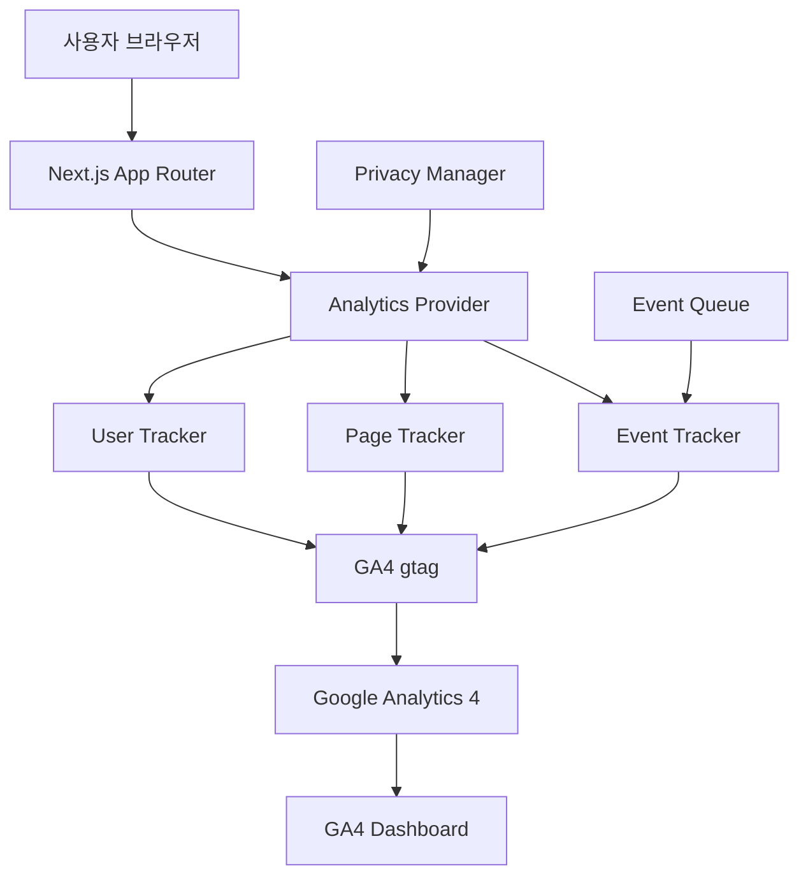

# Google Analytics 통합 시스템 설계

## 개요

AI 룰 마스터 애플리케이션에 Google Analytics 4 (GA4)를 통합하여 사용자 행동 분석 및 서비스 최적화를 위한 데이터 수집 시스템입니다. Next.js 15 App Router 환경에서 최적화된 클라이언트 사이드 및 서버 사이드 추적을 구현합니다.

## 아키텍처

### 전체 시스템 구조



### 핵심 컴포넌트

1. **Analytics Provider (AnalyticsProvider)**
   - GA4 초기화 및 설정 관리
   - 개인정보 보호 설정 적용
   - 전역 분석 컨텍스트 제공

2. **Event Tracker (EventTracker)**
   - 사용자 상호작용 이벤트 추적
   - 커스텀 이벤트 정의 및 전송
   - 이벤트 큐 관리

3. **Page Tracker (PageTracker)**
   - 페이지뷰 자동 추적
   - 라우트 변경 감지
   - 세션 관리

4. **Privacy Manager (PrivacyManager)**
   - 쿠키 동의 관리
   - 데이터 익명화
   - 추적 옵트아웃 처리

## 컴포넌트 및 인터페이스

### AnalyticsProvider

```typescript
interface AnalyticsConfig {
  measurementId: string;
  enableDevelopment: boolean;
  anonymizeIp: boolean;
  cookieFlags: string;
  customDimensions?: Record<string, string>;
}

interface AnalyticsContext {
  trackEvent: (eventName: string, parameters?: EventParameters) => void;
  trackPageView: (path: string, title?: string) => void;
  setUserProperties: (properties: UserProperties) => void;
  isEnabled: boolean;
}

class AnalyticsProvider {
  constructor(config: AnalyticsConfig)
  initialize(): Promise<void>
  getContext(): AnalyticsContext
}
```

### EventTracker

```typescript
interface EventParameters {
  event_category?: string;
  event_label?: string;
  value?: number;
  custom_parameters?: Record<string, any>;
}

interface GameSelectionEvent extends EventParameters {
  game_title: string;
  game_id: string;
  selection_time: number;
  previous_game?: string;
}

interface QuestionEvent extends EventParameters {
  question_length: number;
  game_context: string;
  research_triggered: boolean;
  response_time?: number;
}

class EventTracker {
  trackGameSelection(event: GameSelectionEvent): void
  trackQuestion(event: QuestionEvent): void
  trackResearchUsage(gameTitle: string, complexity: number): void
  trackUserEngagement(sessionDuration: number, interactionCount: number): void
  trackError(errorType: string, errorMessage: string, context: string): void
}
```

### PageTracker

```typescript
interface PageViewData {
  page_path: string;
  page_title: string;
  page_location: string;
  referrer?: string;
  user_engagement?: number;
}

interface SessionData {
  session_id: string;
  session_start: Date;
  page_count: number;
  engagement_time: number;
}

class PageTracker {
  trackPageView(data: PageViewData): void
  trackRouteChange(from: string, to: string): void
  startSession(): string
  endSession(sessionId: string): void
  updateEngagementTime(additionalTime: number): void
}
```

### PrivacyManager

```typescript
interface PrivacySettings {
  analyticsEnabled: boolean;
  advertisingEnabled: boolean;
  functionalEnabled: boolean;
  consentTimestamp: Date;
}

interface AnonymizationConfig {
  anonymizeIp: boolean;
  anonymizeUserAgent: boolean;
  excludePersonalData: boolean;
}

class PrivacyManager {
  getConsentStatus(): PrivacySettings
  updateConsent(settings: Partial<PrivacySettings>): void
  anonymizeData(data: any, config: AnonymizationConfig): any
  shouldTrack(eventType: string): boolean
}
```

## 데이터 모델

### GA4 이벤트 구조

```typescript
// 게임 선택 이벤트
interface GameSelectionEventData {
  event_name: 'game_selection';
  game_title: string;
  game_id: string;
  selection_timestamp: number;
  previous_game_title?: string;
  search_query?: string;
  selection_method: 'click' | 'search' | 'recommendation';
}

// 질문 전송 이벤트
interface QuestionEventData {
  event_name: 'question_submitted';
  game_context: string;
  question_length: number;
  question_type: 'rule' | 'strategy' | 'clarification' | 'other';
  research_triggered: boolean;
  session_question_count: number;
}

// 리서치 사용 이벤트
interface ResearchEventData {
  event_name: 'research_used';
  game_title: string;
  complexity_score: number;
  research_duration: number;
  sources_found: number;
  cache_hit: boolean;
}

// 사용자 참여 이벤트
interface EngagementEventData {
  event_name: 'user_engagement';
  engagement_time_msec: number;
  session_duration: number;
  page_views: number;
  questions_asked: number;
  games_explored: number;
}
```

### 커스텀 차원 (Custom Dimensions)

```typescript
interface CustomDimensions {
  user_type: 'new' | 'returning';
  session_type: 'exploration' | 'focused' | 'research_heavy';
  preferred_games: string[];
  question_complexity: 'simple' | 'moderate' | 'complex';
  research_usage_pattern: 'never' | 'occasional' | 'frequent';
}
```

## Next.js 통합 전략

### App Router 통합

```typescript
// app/layout.tsx
import { AnalyticsProvider } from '@/lib/analytics';

export default function RootLayout({ children }: { children: React.ReactNode }) {
  return (
    <html lang="ko">
      <body>
        <AnalyticsProvider
          measurementId={process.env.NEXT_PUBLIC_GA_MEASUREMENT_ID!}
          enableDevelopment={process.env.NODE_ENV === 'development'}
        >
          {children}
        </AnalyticsProvider>
      </body>
    </html>
  );
}
```

### 페이지별 추적 구현

```typescript
// app/page.tsx (게임 선택 페이지)
import { useAnalytics } from '@/lib/analytics';

export default function GameSelectionPage() {
  const { trackEvent, trackPageView } = useAnalytics();
  
  useEffect(() => {
    trackPageView('/game-selection', '게임 선택');
  }, []);
  
  const handleGameSelect = (game: Game) => {
    trackEvent('game_selection', {
      game_title: game.title,
      game_id: game.id,
      selection_method: 'click'
    });
  };
}
```

### 서버 사이드 추적

```typescript
// middleware.ts
import { NextResponse } from 'next/server';
import type { NextRequest } from 'next/server';

export function middleware(request: NextRequest) {
  // 서버 사이드 분석 데이터 수집
  const response = NextResponse.next();
  
  // 사용자 에이전트, 지역 정보 등 수집
  response.headers.set('x-analytics-data', JSON.stringify({
    userAgent: request.headers.get('user-agent'),
    country: request.geo?.country,
    city: request.geo?.city,
    timestamp: Date.now()
  }));
  
  return response;
}
```

## 개인정보 보호 구현

### 데이터 익명화

```typescript
class DataAnonymizer {
  static anonymizeQuestion(question: string): string {
    // 개인정보 패턴 제거
    return question
      .replace(/\b\d{3}-\d{4}-\d{4}\b/g, '[PHONE]')
      .replace(/\b[A-Za-z0-9._%+-]+@[A-Za-z0-9.-]+\.[A-Z|a-z]{2,}\b/g, '[EMAIL]')
      .replace(/\b\d{6}-\d{7}\b/g, '[ID]');
  }
  
  static anonymizeUserData(userData: any): any {
    const { personalInfo, ...anonymizedData } = userData;
    return {
      ...anonymizedData,
      user_id: this.hashUserId(userData.user_id),
      session_id: this.hashSessionId(userData.session_id)
    };
  }
}
```

### 쿠키 및 동의 관리

```typescript
interface ConsentManager {
  showConsentBanner(): void;
  updateConsentPreferences(preferences: PrivacySettings): void;
  getConsentStatus(): PrivacySettings;
  revokeConsent(): void;
}

// 쿠키 없는 기본 추적
const basicTrackingConfig = {
  anonymize_ip: true,
  allow_google_signals: false,
  allow_ad_personalization_signals: false,
  cookie_flags: 'SameSite=Strict;Secure'
};
```

## 성능 최적화

### 지연 로딩 및 번들 최적화

```typescript
// 동적 임포트를 통한 GA4 스크립트 지연 로딩
const loadGoogleAnalytics = async () => {
  if (typeof window !== 'undefined') {
    const { gtag } = await import('@/lib/gtag');
    return gtag;
  }
};

// 이벤트 배치 처리
class EventBatcher {
  private eventQueue: AnalyticsEvent[] = [];
  private batchSize = 10;
  private flushInterval = 5000; // 5초
  
  addEvent(event: AnalyticsEvent): void {
    this.eventQueue.push(event);
    if (this.eventQueue.length >= this.batchSize) {
      this.flush();
    }
  }
  
  private flush(): void {
    if (this.eventQueue.length > 0) {
      this.sendBatch(this.eventQueue.splice(0));
    }
  }
}
```

## 모니터링 및 대시보드 설정

### GA4 대시보드 구성

1. **실시간 대시보드**
   - 현재 활성 사용자
   - 실시간 페이지뷰
   - 실시간 이벤트

2. **사용자 행동 분석**
   - 게임별 인기도
   - 질문 패턴 분석
   - 세션 지속 시간

3. **전환 및 목표 추적**
   - 게임 선택률
   - 질문 완료율
   - 리서치 활용률

### 커스텀 리포트 설정

```typescript
interface AnalyticsReport {
  name: string;
  metrics: string[];
  dimensions: string[];
  filters?: ReportFilter[];
  dateRange: DateRange;
}

const gamePopularityReport: AnalyticsReport = {
  name: 'Game Popularity Analysis',
  metrics: ['event_count', 'active_users'],
  dimensions: ['game_title', 'date'],
  filters: [
    { dimension: 'event_name', operator: 'equals', value: 'game_selection' }
  ],
  dateRange: { startDate: '30daysAgo', endDate: 'today' }
};
```

## 테스트 전략

### 개발 환경 테스트

```typescript
// 개발 환경에서 GA4 이벤트 검증
class AnalyticsTestHelper {
  static validateEvent(eventName: string, parameters: any): boolean {
    // 이벤트 구조 검증
    // 필수 파라미터 확인
    // 데이터 타입 검증
    return true;
  }
  
  static mockGA4(): void {
    // GA4 함수 모킹
    window.gtag = jest.fn();
  }
}
```

### A/B 테스트 지원

```typescript
interface ABTestConfig {
  testName: string;
  variants: string[];
  trafficAllocation: number[];
  conversionEvents: string[];
}

class ABTestTracker {
  trackVariantExposure(testName: string, variant: string): void {
    this.trackEvent('ab_test_exposure', {
      test_name: testName,
      variant: variant,
      user_id: this.getUserId()
    });
  }
}
```